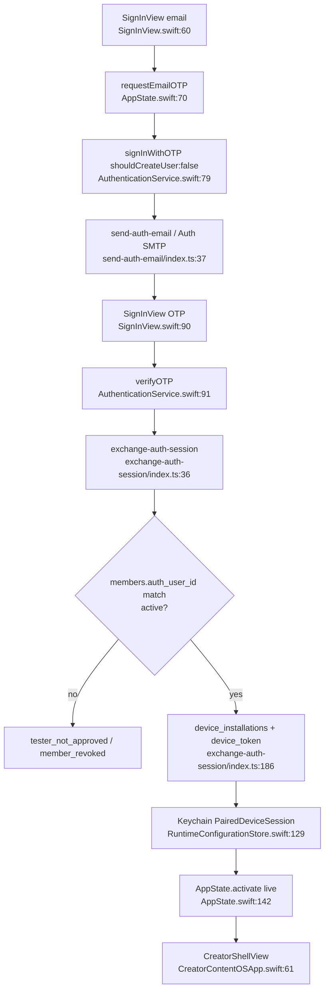

# Sign in with Apple vs current auth (ticket 05 research)

**Question:** How does approved-email OTP / Supabase auth work in ContentHelper today, and what concrete integration path exists for Sign in with Apple on this SwiftUI + Supabase stack?

**Scope:** Current client + Edge Function + schema facts; Apple options against in-repo stack; migration identity keys; product-rule inputs for ticket 06. No product-rule redesign.

**Confidence:** High for OTP E2E, session exchange, roles, AppState gating, and “no Apple capability in project.” Medium for live Dashboard Apple provider state (local `config.toml` only). See §5.

---

## 1. Current auth — approved-email OTP end-to-end

### 1.1 App gate (who sees SignInView)

Launch creates `AppState` and restores auth; UI switches on `authenticationPhase`:

```13:18:CreatorContentOS/App/CreatorContentOSApp.swift
            CreatorContentOSAppView()
                .environment(appState)
                .environment(appState.runtime.services)
                .task {
                    await appState.restoreAuthentication()
                }
                .task {
                    await appState.observeAuthenticationChanges()
                }
```

```54:68:CreatorContentOS/App/CreatorContentOSApp.swift
    private var appView: some View {
        Group {
            switch appState.authenticationPhase {
            case .restoring:
                AuthenticationRestoringView()
            case .live:
                switch appState.activeMode {
                case .creator:
                    CreatorShellView()
                case .admin:
                    AdminShellView()
                }
            case .signedOut, .requestingCode, .verifyingCode, .failed:
                SignInView()
            }
        }
    }
```

Phases: `restoring | signedOut | requestingCode | verifyingCode | live | failed` ([171–178](CreatorContentOS/App/AppState.swift#L171)).

Startup does **not** trust a Keychain-only paired session without Supabase Auth: `makeAuthenticationShellRuntime` only goes live from debug env session, else fixtures ([102–120](CreatorContentOS/App/AppRuntime.swift#L102)); XCTest asserts that contract ([102–110](CreatorContentOSTests/AuthenticationRuntimeTests.swift#L102)).

### 1.2 SignInView — email then 6-digit OTP

Copy states the product gate explicitly: “approved tester email” ([34–39](CreatorContentOS/Features/Authentication/SignInView.swift#L34)).

Flow:

1. Email step → `appState.requestEmailOTP` ([140–144](CreatorContentOS/Features/Authentication/SignInView.swift#L140)).
2. OTP step (6 digits) → `appState.verifyEmailOTP` ([146–148](CreatorContentOS/Features/Authentication/SignInView.swift#L146)).
3. “Use a different email” → `resetSignIn()` ([121–123](CreatorContentOS/Features/Authentication/SignInView.swift#L121)).

### 1.3 AppState orchestration

```70:110:CreatorContentOS/App/AppState.swift
    func requestEmailOTP(_ email: String) async {
        // ...
            try await authenticationService.requestEmailOTP(email: email)
            pendingEmail = email.trimmingCharacters(in: .whitespacesAndNewlines).lowercased()
            authenticationPhase = .signedOut
        // ...
    }

    func verifyEmailOTP(_ token: String) async {
        guard let pendingEmail else { /* fail */ return }
        // ...
            let session = try await authenticationService.verifyEmailOTP(
                email: pendingEmail,
                token: token
            )
            await activate(session: session)
```

On success `activate` sets `runtime` live, `activeMode = .creator`, `authenticationPhase = .live`, then refreshes repositories ([138–154](CreatorContentOS/App/AppState.swift#L138)).

Sign-out: revoke device session (if any) then local auth clear → fixtures + `.signedOut` ([118–162](CreatorContentOS/App/AppState.swift#L118)).

### 1.4 Client AuthenticationService — OTP + exchange

| Step | Code | Behavior |
| --- | --- | --- |
| Request OTP | [76–79](CreatorContentOS/Data/AuthenticationService.swift#L76) | `client.auth.signInWithOTP(email:, shouldCreateUser: false)` — **no auto-signup** |
| Verify OTP | [82–100](CreatorContentOS/Data/AuthenticationService.swift#L82) | `verifyOTP(email:, token:, type: .email)` then `exchangeAuthenticatedSession` |
| Restore | [103–124](CreatorContentOS/Data/AuthenticationService.swift#L103) | Require `currentSession`; refresh; reuse Keychain pair or re-exchange |
| Sign out | [126–157](CreatorContentOS/Data/AuthenticationService.swift#L126) | Invoke `revoke-device-session` with `x-mco-device-token`, clear Keychain, `auth.signOut(scope: .local)` |

Exchange invokes Edge Function `exchange-auth-session` with device name / platform `ios` / installation UUID, then builds `PairedDeviceSession` and saves to Keychain ([183–224](CreatorContentOS/Data/AuthenticationService.swift#L183)).

Stable backend error codes mapped for UI ([37–54](CreatorContentOS/Data/AuthenticationService.swift#L37)): `tester_not_approved`, `member_revoked`, `workspace_unavailable`, `creator_unavailable`, `invalid_auth_session`, `device_session_failed`, `session_revoke_failed`.

### 1.5 Dual session model after OTP

**A. Supabase Auth session** (JWT on bootstrap client).

**B. Device session** stored as `PairedDeviceSession` in Keychain:

```4:16:CreatorContentOS/Data/RuntimeConfigurationStore.swift
struct PairedDeviceSession: Codable, Hashable, Sendable {
    var projectURL: URL
    var publishableKey: String
    var workspaceID: UUID
    var creatorID: UUID
    var memberID: UUID
    var deviceInstallationID: UUID
    var deviceToken: String
    // ...
    var memberRole: String
    var pairedAt: Date
    var authenticatedEmail: String? = nil
```

Keychain: service `com.creatorcontenthelper.runtime`, account `paired-device-session` ([147–149](CreatorContentOS/Data/RuntimeConfigurationStore.swift#L147), [160–161](CreatorContentOS/Data/RuntimeConfigurationStore.swift#L160)).

Live API clients attach `x-mco-device-token` ([15–18](CreatorContentOS/Data/SupabaseClientFactory.swift#L15)). Edge Functions authorize that token via `verifyDeviceSession` ([12–67](supabase/functions/_shared/device-auth.ts#L12)): SHA-256 hash → `device_installations` (non-revoked) → active `members` with allowed role.

### 1.6 Edge Function: `exchange-auth-session`

Called with **Auth bearer JWT** (not device token). Resolves identity by `members.auth_user_id = auth user id` ([86–90](supabase/functions/exchange-auth-session/index.ts#L86)):

| Outcome | Code | Lines |
| --- | --- | --- |
| No membership | `tester_not_approved` | [95–97](supabase/functions/exchange-auth-session/index.ts#L95) |
| No active membership | `member_revoked` | [99–104](supabase/functions/exchange-auth-session/index.ts#L99) |
| ≠1 active membership | `workspace_unavailable` | [106–108](supabase/functions/exchange-auth-session/index.ts#L106) |
| Missing active workspace / creator | `workspace_unavailable` / `creator_unavailable` | [112–132](supabase/functions/exchange-auth-session/index.ts#L112) |
| Success | Issues new device token; upsert/insert `device_installations`; returns workspace/creator/member/role/email/token | [134–197](supabase/functions/exchange-auth-session/index.ts#L134) |

**Creator identity attachment:** first active `creators` row for the member’s workspace (`order created_at asc limit 1`) — not the member’s own row ([122–129](supabase/functions/exchange-auth-session/index.ts#L122)). Role comes from `members.role` returned as `member_role` ([192](supabase/functions/exchange-auth-session/index.ts#L192)).

### 1.7 Edge Function: `send-auth-email`

OTP delivery path for Auth email hooks (Resend). Verifies Standard Webhooks secret, requires 6-digit token, sends from `ContentHelper <auth@contenthelper.in>` ([37–103](supabase/functions/send-auth-email/index.ts#L37)). Local Auth OTP length/expiry also configured ([231–234](supabase/config.toml#L231)); magic-link template path ([251–253](supabase/config.toml#L251)). Deployed with other functions ([43](docs/live-supabase-testflight-runbook.md#L43), [7](scripts/deploy-live-supabase.sh#L7)).

### 1.8 Edge Function: `manage-testers` (allowlist / invite)

Owner-only via device token `allowedRoles: ["owner"]` ([47–51](supabase/functions/manage-testers/index.ts#L47)).

| Action | Effect |
| --- | --- |
| `list` | Active workspace `members` with `role = 'editor'` and non-null email ([72–83](supabase/functions/manage-testers/index.ts#L72)) |
| `invite` | Find/create Auth user by email (`email_confirm: true`), upsert `members` as `role: editor`, `status: active`, bind `auth_user_id`, send OTP with `shouldCreateUser: false` ([225–304](supabase/functions/manage-testers/index.ts#L225), [341–345](supabase/functions/manage-testers/index.ts#L341)) |
| `resend` | OTP to existing active tester ([112–124](supabase/functions/manage-testers/index.ts#L112)) |
| `revoke` | Set editor member `status: revoked`; revoke all their device installations ([139–162](supabase/functions/manage-testers/index.ts#L139)) |
| `bind_creator` | Bind Auth user to existing active `role = 'creator'` member only (does not convert editors) ([165–222](supabase/functions/manage-testers/index.ts#L165)) |

Client repository: `SupabaseTesterAccessRepository` → `manage-testers` ([54–93](CreatorContentOS/Data/SupabaseRepositories.swift#L54)). `AppServices.canManageTesterAccess` = live runtime && `memberRole == "owner"` ([117–119](CreatorContentOS/App/AppServices.swift#L117)).

**UI surface fact:** `TesterAccessView` exists ([691+](CreatorContentOS/Navigation/AdminShellView.swift#L691)) but **current `AdminShellView` TabView only exposes Daily / Weekly / References** ([6–24](CreatorContentOS/Navigation/AdminShellView.swift#L6)). Production call site for `TesterAccessView` in-app is only DEBUG forced screen `MCO_FORCE_SCREEN=tester-access` ([98–120](CreatorContentOS/App/CreatorContentOSApp.swift#L98)). Docs still describe a Testers tab ([7–8](docs/email-otp-tester-access-runbook.md#L7), [15–16](docs/testflight-start-using-contenthelper.md#L15)).

### 1.9 Legacy device pairing (`pair-device`)

Still present as backend + client service; **no production UI calls it**.

- Client: `DevicePairingService.pairDevice(inviteCode:)` ([152–198](CreatorContentOS/Data/DevicePairingService.swift#L152)) — only definition in app target (no other call sites under `CreatorContentOS/`).
- Server: invite-code hash → `device_invites` → create `members` **without** `auth_user_id`/`email` → create `device_installations` ([83–205](supabase/functions/pair-device/index.ts#L83)).
- Docs: “Pairing codes are kept as a backend compatibility boundary, but testers should not need them” ([1–3](docs/email-otp-tester-access-runbook.md#L1)); “No pairing UI is exposed yet” ([64](docs/runtime-device-pairing-creator-content-os-v2.md#L64)).

`revoke-device-session` allows roles `owner|editor|creator|scout` ([40–44](supabase/functions/revoke-device-session/index.ts#L40)).

### 1.10 Schema identity keys (roles / email / auth)

`members` ([40–52](supabase/migrations/20260605000000_initial_content_os_schema.sql#L40)):

- `auth_user_id` → `auth.users` (nullable)
- `role` ∈ `owner | editor | creator | scout`
- `status` ∈ `active | revoked`

Later: `members.email` + uniqueness on active `(workspace_id, email)` and `(workspace_id, auth_user_id)` ([1–32](supabase/migrations/20260610134908_auth_tester_access.sql#L1)). Comment: “Normalized approved sign-in email. Auth identity remains bound by `auth_user_id`” ([31–32](supabase/migrations/20260610134908_auth_tester_access.sql#L31)).

`device_installations`: stores `token_hash` only; raw token returned once ([70–82](supabase/migrations/20260605000000_initial_content_os_schema.sql#L70)).

### 1.11 Role attachment → product surfaces (post-login)

| Role from exchange | Creator shell | Manager (`AdminShellView`) | Generation / publish / import | Tester manage |
| --- | --- | --- | --- | --- |
| `owner` / `editor` | Yes; Profile shows Manager tools when `canAccessAdmin` ([285–288](CreatorContentOS/Navigation/CreatorShellView.swift#L285)) | Yes via `activeMode = .admin` | Allowed (`generate-week` / `publish-week` / import / review / storyboard: owner\|editor) | Owner only (`manage-testers`) |
| `creator` | Yes | No (`canAccessAdmin` false) | Today/archive/profile reads OK; Manager writes/generation blocked ([597–602](supabase/functions/read-content/index.ts#L597); `write-content` creator subset [877–887](supabase/functions/write-content/index.ts#L877)) | No |
| `scout` | Can get device session; `read-content` admin actions blocked; Today-like reads require owner\|editor\|creator ([597–600](supabase/functions/read-content/index.ts#L597)) | No | No | No |

Profile shows `authenticatedEmail` + role chip ([146–165](CreatorContentOS/Navigation/CreatorShellView.swift#L146)).

### 1.12 Current happy-path flowchart



---

## 2. What Sign in with Apple needs on this stack

### 2.1 In-repo facts (primary)

| Fact | Evidence |
| --- | --- |
| No Apple Sign In UI / `AuthenticationServices` usage in app | Grep: only OTP `SignInView`; no `SignInWithAppleButton` in `CreatorContentOS/` |
| No entitlements file / no `com.apple.developer.applesignin` in project | Glob: no `*.entitlements`; `project.pbxproj` has no `CODE_SIGN_ENTITLEMENTS` |
| Bundle ID | `com.prateekranka.creatorcontenthelper` ([35](project.yml#L35), [664](CreatorContentOS.xcodeproj/project.pbxproj)) |
| Team | `DEVELOPMENT_TEAM: 4JRB53LG5C` ([38](project.yml#L38)) |
| Local Supabase Apple provider **disabled** | `[auth.external.apple] enabled = false` ([326–339](supabase/config.toml#L326)) |
| Global Auth signup off; email signup on | `[auth] enable_signup = false` ([176](supabase/config.toml#L176)); `[auth.email] enable_signup = true` ([219–221](supabase/config.toml#L219)) |
| OTP path forbids create-user | `shouldCreateUser: false` ([79](CreatorContentOS/Data/AuthenticationService.swift#L79)) |
| Post-Auth gate is **membership bind**, not provider | `exchange-auth-session` keys on `auth_user_id` ([86–97](supabase/functions/exchange-auth-session/index.ts#L86)) |
| Dependency already supports Apple id_token | `supabase-swift` **2.46.0** ([7–11](CreatorContentOS.xcodeproj/project.xcworkspace/xcshareddata/swiftpm/Package.resolved#L7)); `AuthClient.signInWithIdToken` + `OpenIDConnectCredentials.Provider.apple` in checked-out package |

### 2.2 Concrete options (facts only)

**Option A — Native AuthenticationServices → `signInWithIdToken` (fits current dual-session design)**

1. Obtain Apple `identityToken` via `ASAuthorizationAppleIDCredential` / `SignInWithAppleButton`.
2. Call Supabase `auth.signInWithIdToken(credentials: .init(provider: .apple, idToken:))` (API present in pinned SDK; example in package `Examples/.../SignInWithApple.swift`).
3. Reuse existing `exchangeAuthenticatedSession` → `exchange-auth-session` → Keychain device token (provider-agnostic after JWT exists).
4. Replace OTP-only `SignInView` / `requestEmailOTP` / `verifyEmailOTP` surface; keep restore/signOut/revoke paths.

Requires (not present today): Apple capability/entitlements on the iOS app; Apple Services ID / keys configured for the **live** Supabase Auth Apple provider (local template has stub). Membership still must map `auth.users.id` → `members.auth_user_id` or exchange returns `tester_not_approved`.

**Option B — Supabase OAuth Apple via `signInWithOAuth(provider: .apple)` / ASWebAuthenticationSession**

SDK also exposes `signInWithOAuth` (package `AuthClient`). Local config already lists Apple external provider (disabled). Same post-login exchange path. Heavier redirect/callback surface than native id_token for a pure iOS app.

**Option C — Keep OTP; add Apple as second provider**

Technically possible (Auth can hold multiple identities per user if linking enabled — local `enable_manual_linking = false` ([179](supabase/config.toml#L179))). Destination map asks for Sign in with Apple as only sign-in ([5](.scratch/creator-only-simplify/map.md#L5)); that is product scope for ticket 06, not decided here.

### 2.3 External prerequisites (labeled; not verified in Apple/Supabase dashboards from this repo)

- **EXTERNAL (Apple):** App ID capability “Sign in with Apple”; entitlements `com.apple.developer.applesignin`; App Store Connect / Developer portal config for bundle ID `com.prateekranka.creatorcontenthelper`.
- **EXTERNAL (Supabase):** Enable Apple provider on the hosted project (Services ID, secret key, return URL). Local `config.toml` is not proof of live Dashboard state.

---

## 3. Migration notes for existing OTP / tester accounts

### 3.1 What breaks if Apple replaces OTP without identity migration

| Breakage | Why (evidence) |
| --- | --- |
| Existing Auth users are email-OTP users created by invite/`createUser` | `manage-testers` invite/bind creates Auth users by email ([183–189](supabase/functions/manage-testers/index.ts#L183), [241–251](supabase/functions/manage-testers/index.ts#L241)) |
| New Apple sign-in that creates a **different** `auth.users` row will fail exchange | Lookup is `auth_user_id`, not email ([86–97](supabase/functions/exchange-auth-session/index.ts#L86)) |
| `shouldCreateUser: false` OTP policy does not apply to Apple id_token | OTP client explicitly disables create ([79](CreatorContentOS/Data/AuthenticationService.swift#L79)); Apple path would need an explicit create/allowlist policy |
| Apple Hide My Email / missing email | Local Apple provider `email_optional = false` ([338–339](supabase/config.toml#L338)); `members.email` uniqueness is email-based ([19–21](supabase/migrations/20260610134908_auth_tester_access.sql#L19)); Profile UI shows `authenticatedEmail` ([157–161](CreatorContentOS/Navigation/CreatorShellView.swift#L157)) |
| `manage-testers` invite/resend OTP UX | Entire invite path is email + `signInWithOtp` ([292–345](supabase/functions/manage-testers/index.ts#L292)); Testers UI assumes email ([59–99](CreatorContentOS/Data/AuthenticationDTOs.swift#L59)) |
| `send-auth-email` becomes unused for primary login | Still deployed for Auth email hooks ([43](docs/live-supabase-testflight-runbook.md#L43)) |
| Pair-device orphan members | Pairing creates members with no `auth_user_id` ([156–165](supabase/functions/pair-device/index.ts#L156)) — cannot use OTP/Apple exchange until bound |

### 3.2 Identity keys that exist today

| Key | Where | Role |
| --- | --- | --- |
| `auth.users.id` | Supabase Auth | Bound to `members.auth_user_id` for exchange |
| `members.email` | Normalized email | Allowlist display / invite matching; **not** exchange primary key |
| `members.role` / `status` | Schema | Authorization after device session |
| `device_installations.id` + `token_hash` | Schema | Runtime API auth via `x-mco-device-token` |
| Keychain `PairedDeviceSession` | Client | Restores workspace/creator/member/token/role/email |
| `device_invites.code_hash` | Legacy | Invite-code pairing only |

### 3.3 What can stay unchanged

Device-token Edge Function auth (`verifyDeviceSession`), `PairedDeviceSession` shape, `revoke-device-session`, and role checks on content functions are **auth-provider-agnostic** once a member+installation exist. Only the front door (OTP vs Apple → Auth JWT) and allowlist/bind tooling need to change for Apple-only.

---

## 4. Facts for ticket 06 (product rules grilling)

### 4.1 Who is allowed in today

1. Must have an Auth user that can sign in (OTP path creates users only via owner invite / `bind_creator` / admin create — not from app OTP because `shouldCreateUser: false`).
2. Must have exactly one **active** `members` row with matching `auth_user_id` (else `tester_not_approved` / `member_revoked` / `workspace_unavailable`).
3. Workspace and at least one active `creators` row must exist.
4. Practically documented personas:
   - **Owner:** invite/list/resend/revoke editors; Manager tools ([20–26](docs/email-otp-tester-access-runbook.md#L20)).
   - **Editor tester:** Manager + Creator; cannot manage testers ([22–24](docs/email-otp-tester-access-runbook.md#L22)).
   - **Creator:** Creator mode after OTP/bind; no manager generation / tester controls ([25–27](docs/email-otp-tester-access-runbook.md#L25)).
5. TestFlight instructions: “approved tester email” first; creator path separate ([10–12](docs/testflight-start-using-contenthelper.md#L10), [95+](docs/testflight-start-using-contenthelper.md#L95)).

### 4.2 Surfaces that assume OTP / testers

| Surface | Assumption |
| --- | --- |
| `SignInView` | Email + OTP only ([37](CreatorContentOS/Features/Authentication/SignInView.swift#L37), [60–128](CreatorContentOS/Features/Authentication/SignInView.swift#L60)) |
| `AuthenticationServicing` protocol | OTP request/verify only ([7–13](CreatorContentOS/Data/AuthenticationService.swift#L7)) |
| `TesterAccessView` + `manage-testers` | Email invite/resend/revoke for `editor` |
| Runbooks / TestFlight docs | Approved-email OTP narrative |
| `send-auth-email` | OTP email delivery |
| Quality matrix auth feature language | “returning tester” / OTP restore (docs/quality inspect ndjson F-001) |

### 4.3 App Store / capability prerequisites visible in project

| Item | Present? |
| --- | --- |
| Bundle ID `com.prateekranka.creatorcontenthelper` | Yes ([35](project.yml#L35)) |
| Development team `4JRB53LG5C` | Yes ([38](project.yml#L38)) |
| Sign in with Apple entitlement / capability | **No** (no entitlements file; no capability entries found) |
| Supabase `[auth.external.apple]` enabled | **No** in local config ([327](supabase/config.toml#L327)) |
| `ITSAppUsesNonExemptEncryption = false` | Yes ([21–22](CreatorContentOS/Info.plist#L21)) |

### 4.4 Open product questions (inputs only — do not decide here)

Ticket 06 should grill: who may enter after Testers UI is out of scope; how first Apple launch binds to workspace/creator; how existing OTP `auth_user_id` rows migrate or rebind; whether owner/editor Manager roles remain; whether allowlisting becomes Apple `sub` / email / manual seed; what happens to Hide My Email users.

---

## 5. Sources, confidence, gaps

### 5.1 Primary sources consulted

- Client: `SignInView.swift`, `AppState.swift`, `CreatorContentOSApp.swift`, `AuthenticationService.swift`, `AuthenticationDTOs.swift`, `RuntimeConfigurationStore.swift`, `DevicePairingService.swift`, `SupabaseClientFactory.swift`, `CreatorShellView.swift`, `AdminShellView.swift`, `AppServices.swift`, `SupabaseRepositories.swift`, `AppRuntime.swift`, `Info.plist`, `project.yml`, `Package.resolved`
- Edge: `send-auth-email`, `exchange-auth-session`, `manage-testers`, `pair-device`, `revoke-device-session`, `_shared/device-auth.ts`, role allowlists in `read-content` / `write-content` / `generate-week` / `publish-week` / import / review / storyboard
- Schema: `20260605000000_initial_content_os_schema.sql`, `20260610134908_auth_tester_access.sql`
- Config/docs: `supabase/config.toml`, `docs/email-otp-tester-access-runbook.md`, `docs/runtime-device-pairing-creator-content-os-v2.md`, `docs/testflight-start-using-contenthelper.md`, `docs/live-supabase-testflight-runbook.md`, `scripts/deploy-live-supabase.sh`
- Pinned SDK checkout (DerivedData): `supabase-swift` AuthClient / Types / SignInWithApple example (supports Option A API existence)

### 5.2 Confidence

| Area | Level |
| --- | --- |
| OTP → exchange → device token → AppState live | **High** |
| Role gates on Edge Functions / shells | **High** |
| Pair-device legacy / no UI | **High** |
| TesterAccessView not in Admin TabView | **High** (code); docs diverge |
| Apple integration path via existing exchange | **High** (architecture); **Medium** for exact hosted Auth Apple settings |
| Live production membership data / who is already bound | **Not inspected** (no live DB dump in this research) |

### 5.3 Gaps

- Live Supabase Dashboard: whether Apple provider, Send Email hook, or signup flags match `config.toml`.
- Whether any existing Auth users already have Apple identities linked.
- Whether `TesterAccessView` was intentionally removed from Manager tabs vs docs lag.
- Exact App Store “Sign in with Apple required if other third-party login” policy applicability once OTP is removed — **EXTERNAL legal/App Review**, not encoded in repo.
- No in-repo automated test covering Apple id_token exchange.

---

## Executive summary (5 bullets)

1. **Today’s gate is email OTP with `shouldCreateUser: false`, then `exchange-auth-session` binds `auth.users.id` → `members.auth_user_id` and issues a device token** used as `x-mco-device-token` for all live Edge Functions.
2. **Roles (`owner`/`editor`/`creator`/`scout`) and creator workspace IDs attach at exchange time; AppState only shows the app when `authenticationPhase == .live`.**
3. **Sign in with Apple is not implemented; no entitlements; local Apple provider disabled; best fit is native Apple id_token → existing `signInWithIdToken` (supabase-swift 2.46) → same exchange/device-token path.**
4. **Migrating without rebinding `members.auth_user_id` breaks existing OTP testers; email invite tooling and `send-auth-email` are OTP-specific.**
5. **Ticket 06 must define who may enter without Testers UI, how Apple identities map to members, and Manager/creator allowlisting once OTP is gone — facts above, no rules decided here.**
