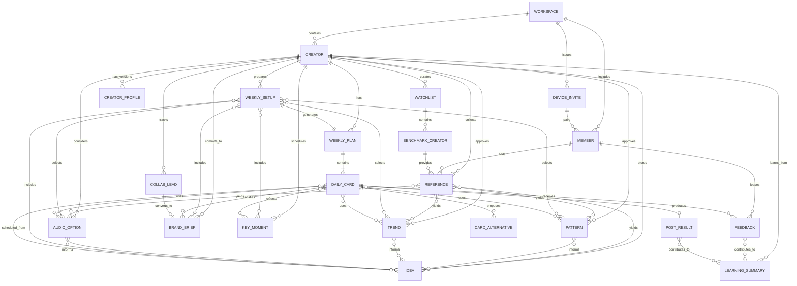
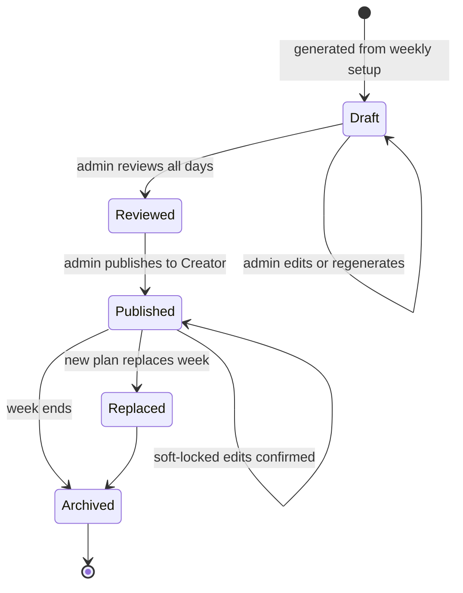
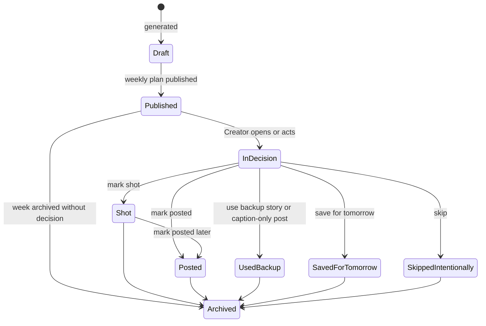
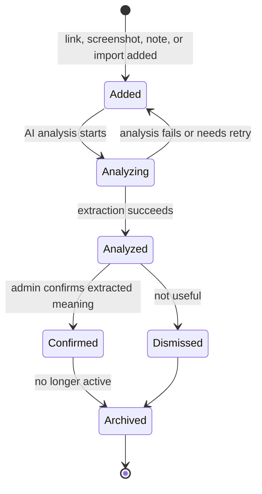
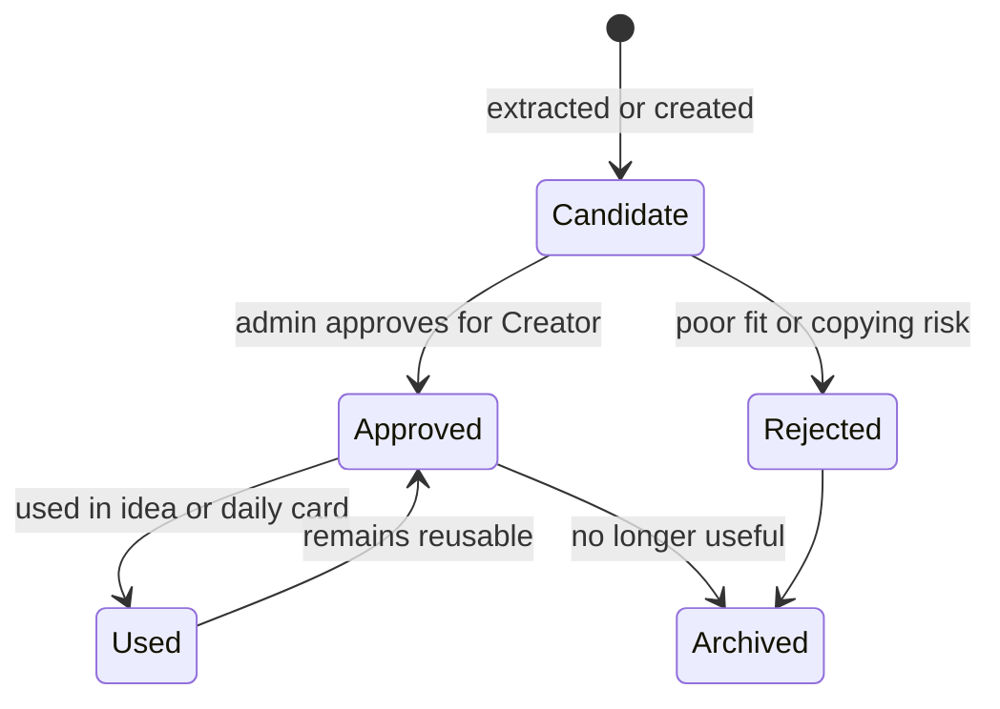
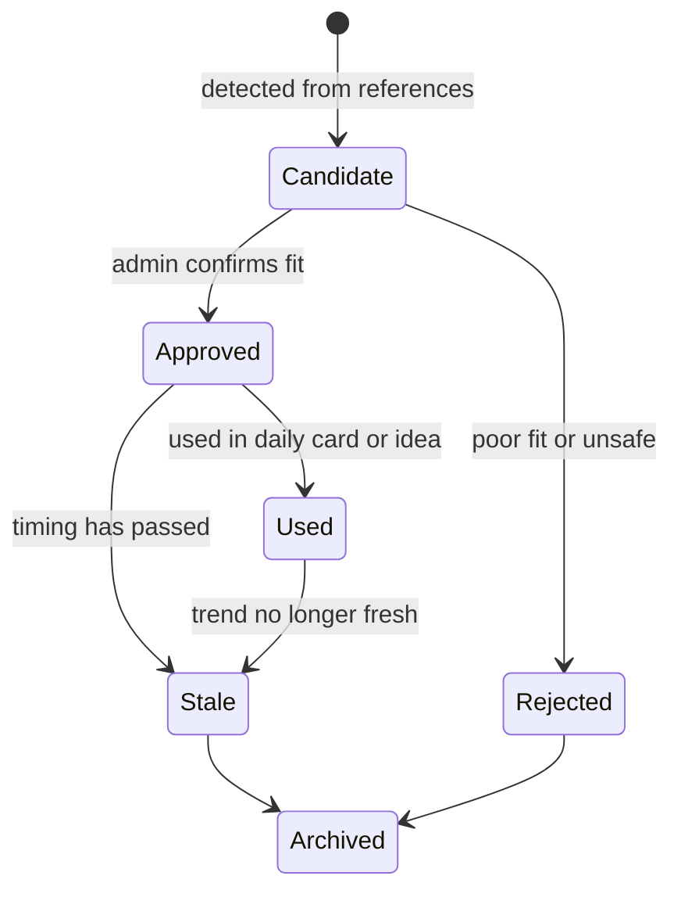
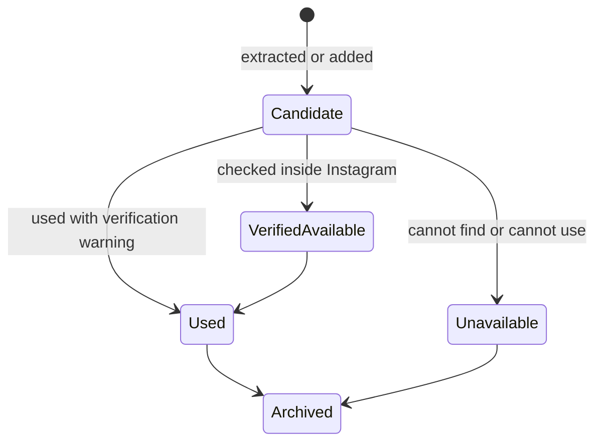
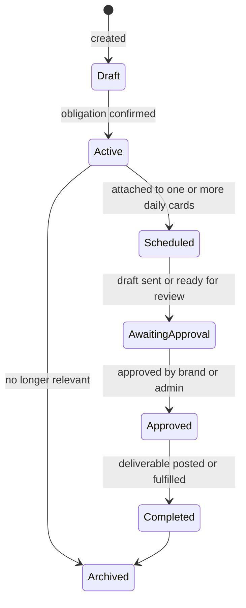
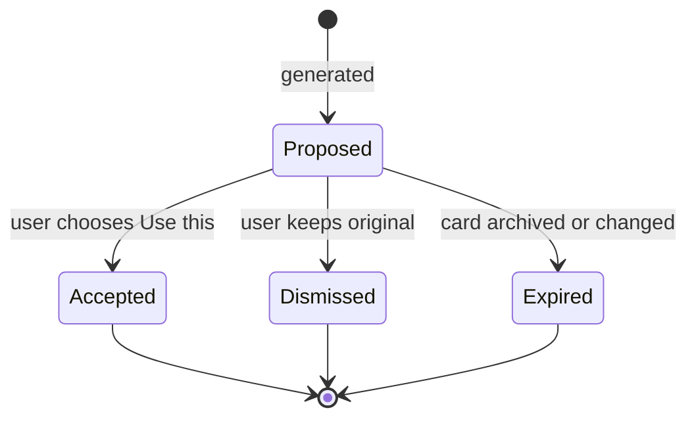

# Layers Conceptual Model: Creator Content OS V2

Source reviewed: `/tmp/codex-remote-attachments/019e91d6-f797-7072-bc8c-b5db7482e6cf/D4864C26-EC4C-4E92-BC1D-B275F97C5DE7/1-creator-content-os-v2-prd.md`

This is a product conceptual model, not a database schema. It defines the things the product recognises from a user perspective, their relationships, lifecycle states, and vocabulary.

## Scope

Product: Creator Content OS, a native iPhone app that turns Manager's weekly setup and curated source intelligence into one prepared, shootable daily content card for Creator.

Core job:

- Manager prepares the week.
- Creator opens the app and knows exactly what to shoot today.
- The system learns lightly from decisions, edits, references, trends, and outcomes.

## Conceptual Model Decision

The PRD currently has many schema-like nouns that overlap: `trend_observation`, `trend_cluster`, `reference_post`, `content_pattern`, `idea_bank_item`, `audio_candidate`, `daily_card_reference`.

The product model should make a sharper distinction:

- **Reference**: raw source material someone added.
- **Pattern**: reusable structure extracted from references.
- **Trend**: time-sensitive cluster extracted from references.
- **Audio Option**: specific audio that may be used in a card.
- **Idea**: unscheduled content concept ready to become a card.
- **Daily Card**: scheduled, prepared, date-specific content package.

This keeps source material separate from planning material and prevents the app from becoming a schema-driven admin tool.

## Noun Foraging

### Raw Nouns From The PRD

Creator, Manager, scout, future user, workspace, creator, user, role, device, invite, creator profile, voice rules, content pillars, preferred hooks, caption style, no-go topics, weekly routine, recurring formats, weekly setup, location, workout plan, race schedule, family moment, travel moment, brand obligation, event, festival, key date, energy constraint, shooting constraint, context visual, trend, audio, influencer watchlist, source list, influencer, creator profile, handle, platform, region, niche tag, audience tag, reference reel, audio link, screenshot, screen recording, provider, brand, campaign, deliverable, due date, post date, review deadline, disclosure, approval status, usage rights, payment status, event, content angle, scenes, archive, feedback, final post link, performance notes, weekly plan, daily card, backup, idea bank, warning, assumption, conflict, script, caption, on-screen text, CTA, hashtags, cover text, post instructions, audio fallback, Creator Fit Score, trend cluster, content pattern, source provenance, learning summary, performance snapshot.

### Product Objects

- Workspace
- Creator
- Member
- Role
- Device Invite
- Creator Profile
- Weekly Setup
- Weekly Plan
- Daily Card
- Card Alternative
- Idea
- Reference
- Watchlist
- Benchmark Creator
- Pattern
- Trend
- Audio Option
- Brand Brief
- Collab Lead
- Key Moment
- Feedback
- Learning Summary
- Post Result

### Attributes, Not Objects

- Voice rules
- Content pillars
- Caption style
- Preferred hooks
- No-go topics
- Weekly routine
- Language mode
- Shootability
- Energy required
- Creator Fit Score
- Availability confidence
- Approval status
- Disclosure requirement
- Usage rights
- Posting window
- Source provenance
- Tags
- Region
- Platform

### Set Aside As Implementation/UI Details

- Supabase table names
- Edge Functions
- Sync events
- SwiftData cache rows
- Screen tabs
- JSON payloads
- AI function names
- Storage paths
- API adapters
- Notifications

## Object Definitions

### Workspace

What it is: A private operating space containing creators, members, source material, plans, and history.

Attributes:

- Name
- Created date
- Active/inactive state

Relationships:

- Has one or more Creators
- Has one or more Members
- Has many Watchlists, References, Weekly Plans, and Learning Summaries

Actions:

- Pair device
- Invite member
- Revoke member/device

Visibility:

- Admin-only in V2; invisible to Creator unless future multi-workspace support exists.

### Creator

What it is: The person whose content the system prepares.

Attributes:

- Display name
- Active status

Relationships:

- Belongs to one Workspace
- Has one active Creator Profile
- Has many Weekly Plans, References, Patterns, Trends, Audio Options, Ideas, Brand Briefs, Collab Leads, Key Moments, and Learning Summaries

Actions:

- View creator home
- Update profile

Visibility:

- V2 UI can simply say "Creator."

### Member

What it is: A person using the app within a workspace.

Attributes:

- Display name
- Role
- Paired devices
- Active/revoked state

Relationships:

- Belongs to one Workspace
- Can create or edit objects depending on Role
- Can leave Feedback

Actions:

- Pair device
- Edit allowed content
- Add references
- Complete daily decisions

Role names:

- Owner: can manage everything
- Editor: can prepare and publish plans
- Creator: daily user; can edit if deliberately entering setup
- Scout: can add references and notes only

### Device Invite

What it is: A temporary code that lets a person pair a phone to a workspace and role.

Attributes:

- Code
- Role granted
- Expiry
- Use limit
- Used count
- Revoked state

Relationships:

- Belongs to one Workspace
- Creates one or more paired Member devices

Actions:

- Create invite
- Use invite
- Revoke invite

### Creator Profile

What it is: The editable memory that defines how Creator should sound, what she posts about, and what the system should avoid.

Attributes:

- Positioning
- Voice rules
- Content pillars
- Preferred hooks
- Caption style
- Things Creator would never say
- Weekly routine
- Family/race/travel context
- Brand tone
- Language preferences
- Recurring formats
- Trend filter rules
- Influencer adaptation rules
- Version

Relationships:

- Belongs to one Creator
- Informs Weekly Plans, Daily Cards, Pattern fit, Trend fit, and Learning Summaries
- Can be revised by Members with owner/editor/creator setup access

Actions:

- Edit profile section
- Save new version
- Restore previous version

State:

- Draft, Active, Superseded

### Weekly Setup

What it is: Manager's weekly input packet: the real-world context the next Weekly Plan should respect.

Attributes:

- Week start date
- Location
- Workout/race schedule
- Family/travel moments
- Energy constraints
- Shooting constraints
- No-go topics
- Selected trends/audio
- Selected brand briefs
- Selected key moments
- Notes

Relationships:

- Belongs to one Creator
- Draws from Creator Profile, Brand Briefs, Collab Leads, Key Moments, Trends, Patterns, Audio Options, Ideas, and References
- Produces one Weekly Plan

Actions:

- Create setup
- Add context
- Select source material
- Generate weekly plan

State:

- Empty, In Progress, Ready to Generate, Used

### Weekly Plan

What it is: A 7-day prepared content plan for a creator.

Attributes:

- Week start date
- Status
- Strategy summary
- Warnings
- Assumptions
- Published date

Relationships:

- Belongs to one Creator
- Is generated from one Weekly Setup
- Contains seven Daily Cards
- May use Trends, Patterns, Audio Options, Brand Briefs, Key Moments, and Ideas
- Produces Archive history through completed Daily Cards

Actions:

- Generate
- Review
- Edit day
- Swap days
- Rebalance
- Inject brand/event
- Publish
- Archive

State:

- Draft, Reviewed, Published, Archived, Replaced

### Daily Card

What it is: The prepared content package for one date.

Attributes:

- Date
- Title
- Why today
- Growth job
- Content pillar
- Shootability
- Estimated shoot time
- Energy required
- Language mode
- Scene list
- Script
- No-voiceover version
- On-screen text
- Caption
- CTA
- Hashtags
- Cover text
- Post instructions
- Brand/event notes
- Backup story
- Caption-only backup
- Creator Fit Score
- Risk notes
- Assumptions
- Completion state

Relationships:

- Belongs to one Weekly Plan
- May use one or more Patterns
- May use one or more Trends
- May use one or more Audio Options
- May satisfy one Brand Brief
- May relate to one Key Moment
- May originate from one Idea
- Has zero or more Card Alternatives
- Has zero or more Feedback items
- May produce one Post Result

Actions:

- Mark can shoot
- Request easier option
- Create alternative
- Use alternative
- Copy script/caption/audio notes
- Mark shot
- Mark posted
- Save for tomorrow
- Skip intentionally
- Leave feedback

State:

- Draft, Published, In Decision, Shot, Posted, Used Backup, Saved for Tomorrow, Skipped Intentionally, Archived

### Card Alternative

What it is: A proposed replacement or variation for part or all of a Daily Card.

Attributes:

- Reason requested
- Changed fields
- Explanation of changes
- Lost requirements
- Created date

Relationships:

- Belongs to one Daily Card
- May use a different Trend, Pattern, or Audio Option from the original card
- Created by a Member or AI action

Actions:

- Preview
- Use this
- Dismiss

State:

- Proposed, Accepted, Dismissed, Expired

### Idea

What it is: An unscheduled content concept that may become a Daily Card later.

Attributes:

- Title
- Summary
- Tags
- Suggested use
- Shootability
- Fit score
- Notes

Relationships:

- Belongs to one Creator
- May be derived from a Reference, Trend, Pattern, Brand Brief, Key Moment, or Learning Summary
- May become one Daily Card

Actions:

- Save
- Schedule
- Use as backup
- Dismiss

State:

- Saved, Scheduled, Used, Dismissed, Archived

### Reference

What it is: Raw source material added for inspiration, trend detection, or proof.

Examples:

- Instagram reel link
- Audio link
- Screenshot
- Screen recording
- Manual note
- Example post from a benchmark creator
- CSV/list row imported as source material

Attributes:

- Source type
- URL or media
- Manual notes
- Provenance
- Added by
- Added date
- Analysis confidence

Relationships:

- Belongs to one Creator
- May be attached to one Benchmark Creator
- May come from one Watchlist
- May yield one or more Patterns
- May yield one or more Trends
- May yield one or more Audio Options
- May yield one or more Ideas

Actions:

- Add
- Analyze
- Confirm extracted meaning
- Dismiss
- Archive
- Open source

State:

- Added, Analyzing, Analyzed, Confirmed, Dismissed, Archived

Important boundary:

- A pasted reel, audio link, screenshot, or screen recording starts as a Reference. It becomes a Trend, Pattern, Audio Option, or Idea only after analysis and confirmation.

### Watchlist

What it is: A curated set of benchmark creators or source rows Manager wants the system to learn from.

Attributes:

- Name
- Kind
- Source description
- Provenance notes
- Last reviewed date
- Status

Relationships:

- Belongs to one Creator
- Contains many Benchmark Creators
- Can produce References

Actions:

- Import list
- Add creator
- Review
- Archive

State:

- Active, Needs Review, Archived

### Benchmark Creator

What it is: An external creator used as a reference for formats, patterns, and positioning, not for copying.

Attributes:

- Handle
- Display name
- Platform
- Region
- Niche tags
- Audience tags
- Relevance notes
- Priority score
- Creator relevance score
- Status

Relationships:

- Belongs to one or more Watchlists
- Has many References
- Can contribute to Patterns and Trends

Actions:

- Add reference
- Mark high priority
- Mark poor fit
- Archive

State:

- Candidate, Active, Poor Fit, Archived

### Pattern

What it is: A reusable content structure extracted from references or authored by Manager.

Examples:

- Hook formula
- Scene structure
- Caption formula
- Brand integration style
- Recurring series
- Edit style
- CTA pattern

Attributes:

- Title
- Pattern type
- Summary
- Fit notes
- Avoid notes
- Creator adaptation
- Complexity score
- Creator Fit Score

Relationships:

- Belongs to one Creator
- Derived from zero or more References
- May inform many Ideas and Daily Cards

Actions:

- Approve
- Reject
- Use in card
- Archive

State:

- Candidate, Approved, Rejected, Used, Archived

Important boundary:

- A Pattern is reusable and not time-sensitive. If it is time-sensitive, model it as a Trend.

### Trend

What it is: A time-sensitive opportunity detected from one or more references, often involving a repeated audio, hook, visual format, or niche behaviour.

Attributes:

- Title
- Summary
- First seen
- Last seen
- Region
- Niche
- Hook pattern
- Visual pattern
- Caption pattern
- Saturation note
- Timing recommendation
- Creator adaptation
- Creator Fit Score

Relationships:

- Belongs to one Creator
- Derived from one or more References
- May include one or more Audio Options
- May inform Ideas, Card Alternatives, and Daily Cards

Actions:

- Approve
- Reject
- Save for later
- Use this week
- Use today
- Archive

State:

- Candidate, Approved, Rejected, Used, Stale, Archived

Important boundary:

- A Trend is an interpreted cluster. A single screenshot is not a Trend until confirmed or clustered.

### Audio Option

What it is: A specific audio choice that can be recommended for a Daily Card.

Attributes:

- Audio name
- Artist or original creator
- Audio URL
- Source reel URL
- Region seen
- Usage notes
- Availability confidence
- Verification note
- Fallback

Relationships:

- Belongs to one Creator
- May be derived from References or Trends
- May be used by Daily Cards
- May have one fallback Audio Option

Actions:

- Verify inside Instagram
- Mark available
- Mark unavailable
- Use in card
- Archive

State:

- Candidate, Verified Available, Unavailable, Used, Archived

### Brand Brief

What it is: A committed brand/collab obligation with constraints the weekly plan must respect.

Attributes:

- Brand name
- Campaign title
- Deliverable
- Due date
- Post date
- Review deadline
- Mandatory points
- Must avoid
- Required tags
- Disclosure requirement
- Tone
- Approval status
- Usage rights notes
- Payment/barter status
- Notes

Relationships:

- Belongs to one Creator
- May be linked to one or more Daily Cards
- May be associated with Key Moments or References

Actions:

- Add brief
- Edit constraints
- Attach to day
- Mark draft ready
- Mark approved
- Mark completed
- Archive

State:

- Draft, Active, Scheduled, Awaiting Approval, Approved, Completed, Archived

Important boundary:

- Use Brand Brief only for real obligations. Potential brands live as Collab Leads.

### Collab Lead

What it is: A possible future brand or collaboration that may become a Brand Brief.

Attributes:

- Brand name
- Category
- Fit notes
- Contact/status notes
- Reference links

Relationships:

- Belongs to one Creator
- May become one Brand Brief
- May provide context for future Ideas

Actions:

- Save lead
- Add note
- Promote to brand brief
- Dismiss

State:

- Saved, Contacted, Converted, Dismissed, Archived

### Key Moment

What it is: A scheduled real-world moment that should influence content.

Examples:

- Race
- Travel day
- Family visit
- Festival
- Class
- Recovery day
- Launch moment

Attributes:

- Name
- Date
- Location
- Kind
- Content angle
- Required scenes
- Pre-event notes
- Post-event notes

Relationships:

- Belongs to one Creator
- May influence one or more Daily Cards
- May conflict with Brand Briefs or workout rhythm

Actions:

- Add moment
- Attach to week
- Use as content angle
- Archive

State:

- Upcoming, Active, Completed, Archived

### Feedback

What it is: A lightweight signal from Creator or Manager about a card, idea, pattern, trend, or output.

Attributes:

- Tags
- Optional note
- Created by
- Created date

Relationships:

- Belongs to one Creator
- Usually belongs to one Daily Card
- May also refer to a Pattern, Trend, Idea, or Brand Brief
- Informs Learning Summaries and future Weekly Plans

Actions:

- Add feedback
- Include in learning

Allowed tags:

- Too hard to shoot
- Too long
- Not my voice
- Too generic
- Loved this
- Use more like this
- Too much trend
- Too brand-heavy
- Good brand integration
- Audio unavailable
- Need more Hinglish
- More family humour

### Learning Summary

What it is: A periodic summary of what the system should remember from recent decisions, edits, feedback, and results.

Attributes:

- Period
- Worked well
- Did not work
- Voice learnings
- Shootability learnings
- Brand learnings
- Trend learnings
- Next week recommendations

Relationships:

- Belongs to one Creator
- Synthesizes Daily Cards, Feedback, Post Results, and Card revisions
- Informs future Weekly Setups and Weekly Plans

Actions:

- Generate summary
- Edit summary
- Use in next week

State:

- Draft, Approved, Superseded

### Post Result

What it is: The record of what happened after a Daily Card became real Instagram content.

Attributes:

- Final Instagram post link
- Manual notes
- Optional performance numbers
- Captured date

Relationships:

- Belongs to one Daily Card
- May inform Feedback and Learning Summaries

Actions:

- Add post link
- Add notes
- Add performance snapshot

State:

- Linked, Not Linked, Updated

## Object Map

Cardinality note: `||` means exactly one, `o|` means zero or one, `o{` means zero or many, and `|{` means one or many.

## State Transitions

### Weekly Plan

Design decision:

- Creator should only see Published Weekly Plans by default.
- Draft and Reviewed plans are admin-facing.
- Completed days inside a Published plan should not be changed by midweek replanning.

### Daily Card

Design decision:

- Completion means a decision was made, not necessarily that a post was published.
- "Can shoot today" is not a final state; it is an intent signal. Final states are shot, posted, backup, saved, or skipped.

### Reference

Design decision:

- Analysis alone does not make a reference usable. It must be confirmed before it can produce approved Trends, Patterns, Audio Options, or Ideas.

### Pattern

Design decision:

- A Pattern can be used many times. Use does not consume it.

### Trend

Design decision:

- A Trend is time-sensitive. Stale trends should not drive new Daily Cards, but can remain as historical learning.

### Audio Option

Design decision:

- The app can recommend Candidate audio with a verification note, but should distinguish this from Verified Available audio.

### Brand Brief

Design decision:

- Brand Brief is only for obligations. Potential brands should remain Collab Leads.

### Card Alternative

Design decision:

- Alternatives never overwrite a Daily Card automatically.

## Temporal Decisions

### History

Keep history for:

- Creator Profile versions
- Daily Card revisions
- Accepted and dismissed Card Alternatives
- Completion decisions
- Feedback
- Learning Summaries

Reason: edits and completion decisions teach the system what was too hard, off-voice, or effective.

### Deletion

Default deletion should be archive/dismiss, not hard delete.

Hard delete should only exist for:

- Accidentally uploaded private media
- Incorrect pairing/device records
- Compliance/privacy cleanup

### Relationship Temporality

When a Daily Card uses a Pattern, Trend, Audio Option, Brand Brief, or Key Moment, it should preserve the version or summary it used at generation time.

Reason: if a Pattern or Brand Brief changes later, past cards should still explain what they were based on.

### Read Model Lag

User experience requirement:

- Creator's Today card should appear instantly from local cache.
- Admin changes can show "syncing" or "updated after refresh," but Creator should not see blank daily content because sync is slow.

Engineering question:

- Whether to use optimistic updates for Creator's completion states or queue them offline until confirmed.

## Ubiquitous Language

### Nouns

Term: Workspace  
Rejected alternatives: Account, project, tenant  
Decision: Workspace is neutral and future-proof for multiple creators without making V2 feel like SaaS.

Term: Creator  
Rejected alternatives: Client, profile owner, talent  
Decision: Creator is the person content is for. In V2 this is Creator.

Term: Member  
Rejected alternatives: User  
Decision: Member describes a person inside a workspace. `User` can remain an implementation term but is too generic for product vocabulary.

Term: Creator Profile  
Rejected alternatives: Memory, custom GPT knowledge, strategy profile  
Decision: Creator Profile is the editable product memory for voice, pillars, routine, and rules.

Term: Weekly Setup  
Rejected alternatives: Setup context, weekly input packet, planning brief  
Decision: Weekly Setup is the admin action/object Manager prepares before generation.

Term: Weekly Plan  
Rejected alternatives: Calendar, content plan, schedule  
Decision: Weekly Plan is the 7-day published plan, not a generic calendar.

Term: Daily Card  
Rejected alternatives: Today card, content package, post brief  
Decision: Daily Card is the scheduled daily unit. "Today" is a surface placement, not the object name.

Term: Card Alternative  
Rejected alternatives: Regeneration, variant, rewrite  
Decision: Card Alternative makes non-destructive AI changes explicit.

Term: Reference  
Rejected alternatives: Reference post, trend observation, source, input  
Decision: Reference is the raw source material. This consolidates screenshots, reel links, audio links, notes, and example posts.

Term: Watchlist  
Rejected alternatives: Source list, influencer list  
Decision: Watchlist is the curated set Manager manages. It can include the top 500 influencer list.

Term: Benchmark Creator  
Rejected alternatives: Influencer profile, source creator  
Decision: Benchmark Creator makes the role clear: used for learning and comparison, not copying.

Term: Pattern  
Rejected alternatives: Content pattern, format, formula  
Decision: Pattern is reusable and non-time-sensitive.

Term: Trend  
Rejected alternatives: Trend cluster, trend observation, signal  
Decision: Trend is the approved time-sensitive opportunity. Raw signals remain References until confirmed.

Term: Audio Option  
Rejected alternatives: Audio candidate, song, sound  
Decision: Audio Option is precise and includes availability/verification uncertainty.

Term: Idea  
Rejected alternatives: Idea bank item, saved idea  
Decision: Idea is an unscheduled content concept that may become a Daily Card.

Term: Brand Brief  
Rejected alternatives: Brand item, collab obligation, campaign  
Decision: Brand Brief names the committed obligation and its constraints.

Term: Collab Lead  
Rejected alternatives: Brand lead, prospect  
Decision: Collab Lead is not yet an obligation. It can later become a Brand Brief.

Term: Key Moment  
Rejected alternatives: Event, moment, schedule item  
Decision: Key Moment covers races, travel, family, festivals, classes, recovery, and launches without overfitting to "event."

Term: Feedback  
Rejected alternatives: Feedback event, note, tag  
Decision: Feedback is a lightweight learning signal from Creator or Manager.

Term: Learning Summary  
Rejected alternatives: Insights, analytics, performance report  
Decision: Learning Summary keeps the product away from dashboard analytics while preserving what matters.

Term: Post Result  
Rejected alternatives: Performance snapshot, final post, archive result  
Decision: Post Result records what happened after a Daily Card became Instagram content.

### Verbs

Verb: Pair  
Applies to: Device Invite, Member device  
Rejected alternatives: Login, authenticate, register  
Decision: V2 avoids full auth; pairing names the actual operation.

Verb: Prepare  
Applies to: Weekly Setup  
Rejected alternatives: Configure, set up, input  
Decision: Prepare matches Manager's weekly job.

Verb: Generate  
Applies to: Weekly Plan, Daily Card, Learning Summary  
Rejected alternatives: Create, build  
Decision: Use Generate when AI produces a draft from structured inputs.

Verb: Review  
Applies to: Weekly Plan, Daily Cards, References  
Rejected alternatives: Check, inspect  
Decision: Review means a human validates before something is published or approved.

Verb: Publish  
Applies to: Weekly Plan  
Rejected alternatives: Send, release, activate  
Decision: Publish means Creator can now see and use the plan. It does not mean Instagram posting.

Verb: Add  
Applies to: Reference, Key Moment, Collab Lead, Brand Brief  
Rejected alternatives: Create, upload, import  
Decision: Use Add for user-supplied objects. Use Import when adding many rows from a list.

Verb: Import  
Applies to: Watchlist  
Rejected alternatives: Upload list, ingest  
Decision: Import names the bulk-list operation.

Verb: Analyze  
Applies to: Reference  
Rejected alternatives: Extract, process  
Decision: Analyze means the system reads a raw Reference and proposes meaning.

Verb: Confirm  
Applies to: analyzed Reference outputs  
Rejected alternatives: Approve  
Decision: Confirm means "the extraction is accurate." Approve means "this is fit for Creator."

Verb: Approve  
Applies to: Pattern, Trend, Brand Brief  
Rejected alternatives: Confirm, accept  
Decision: Approve means "safe/useful enough to use in planning."

Verb: Schedule  
Applies to: Idea, Brand Brief, Key Moment  
Rejected alternatives: Use, place  
Decision: Schedule means assigning to a date or Weekly Plan.

Verb: Use this  
Applies to: Card Alternative  
Rejected alternatives: Accept, apply  
Decision: Surface language should be concrete for Creator. Internally the state is Accepted.

Verb: Mark shot / Mark posted / Save for tomorrow / Skip intentionally  
Applies to: Daily Card  
Rejected alternatives: Complete, done  
Decision: Separate verbs preserve meaningful completion differences.

Verb: Archive  
Applies to: Weekly Plan, Reference, Pattern, Trend, Brand Brief, Key Moment, Post Result  
Rejected alternatives: Delete  
Decision: Archive preserves history and learning.

Verb: Dismiss  
Applies to: Card Alternative, Idea, Reference, Trend, Collab Lead  
Rejected alternatives: Delete, reject  
Decision: Dismiss means "not useful now" without implying permanent deletion.

## Key Model Resolutions

### Reference vs Trend vs Pattern

Decision:

- A Reference is raw material.
- A Trend is time-sensitive and clustered/confirmed.
- A Pattern is reusable and not time-sensitive.

Implication:

- Do not show `trend_observation` or `reference_post` as primary product concepts. Those are implementation details under Reference.

### Idea vs Daily Card

Decision:

- An Idea is unscheduled.
- A Daily Card is scheduled for a date and ready to act on.

Implication:

- Backups can be stored on the Daily Card or as Ideas linked to it, but Creator should experience them as lower-effort options for today.

### Brand Brief vs Collab Lead

Decision:

- Brand Brief is a real obligation with due dates and constraints.
- Collab Lead is a possible future brand.

Implication:

- The Weekly Plan generator treats Brand Briefs as hard constraints, not Collab Leads.

### Key Moment vs Brand Brief

Decision:

- Key Moment is a real-world event or context.
- Brand Brief is a commercial obligation.

Implication:

- Both can constrain scheduling, but Brand Briefs carry approval/disclosure requirements.

### Approval Vocabulary

Decision:

- Confirm extraction accuracy.
- Approve fit for Creator.
- Publish visibility to Creator.

Implication:

- Avoid using "approved" for everything. It hides different real-world operations.

## Open Questions

1. Should Creator see source names for Trends and Patterns, or only the adapted idea and audio link?
2. Should a single Reference be allowed to produce both a Trend and a Pattern, or should the admin choose one primary interpretation?
3. Should Audio Option verification be required before publishing a Daily Card, or is a verification warning enough?
4. Should a Saved for Tomorrow Daily Card become a new Idea, move to tomorrow, or create a Card Alternative for tomorrow?
5. Should "Can shoot today" remain an intent signal only, or should it create a visible in-progress state?
6. Should Post Result be required for Posted completion, or optional?
7. Should Brand Brief approval status track brand approval, Manager approval, or both separately?
8. What is the minimum object set for the first TestFlight proof: can Watchlists and Benchmark Creators be read-only/import-only at first?
9. Should Learning Summaries be visible to Creator, or admin-only?
10. Should hard delete exist in UI at all, or only as an admin/developer operation?

## Next Layer

The conceptual model defines what exists in this product. Next: design how users interact with those objects. Run `/layers-interaction-flow`.

