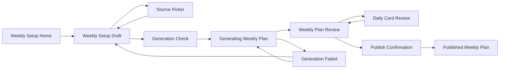
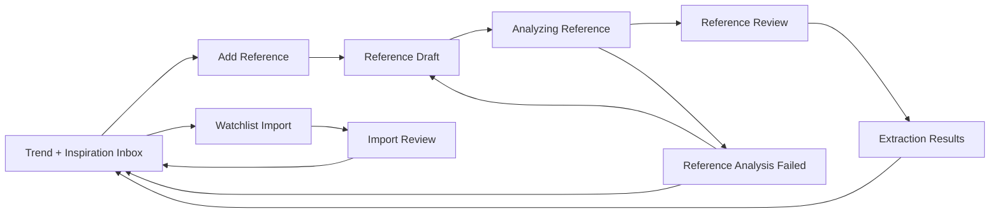
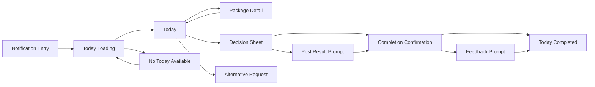
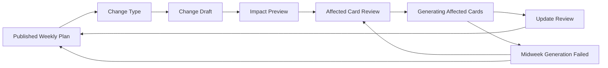
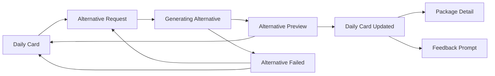

# Layers Interaction Flow: Creator Content OS V2

Source inputs:

- V2 PRD draft: `/tmp/codex-remote-attachments/019e91d6-f797-7072-bc8c-b5db7482e6cf/D4864C26-EC4C-4E92-BC1D-B275F97C5DE7/1-creator-content-os-v2-prd.md`
- Conceptual model: `docs/layers-conceptual-model-creator-content-os-v2.md`

This document defines interaction logic without committing to visual form.

## Flow Principles

- Creator starts in Daily Mode. Manager starts in Setup Mode.
- Published Daily Cards are stable. Changes are explicit and explainable.
- AI actions create drafts, analysis, or alternatives. A human confirms before they become usable planning material.
- Raw source material is always a Reference first.
- "Confirm" means extraction accuracy. "Approve" means fit for Creator. "Publish" means Creator can see it.
- Offline support is required for Creator's Today flow, but not for generation, trend analysis, or publishing.

---

## 1. Weekly Setup Flow

### Job Story

As Manager, when a new week is approaching, I want to prepare Creator's context, source material, brand obligations, and schedule, so that I can generate and publish a 7-day plan Creator can use without prompting or researching.

### Success

A Reviewed Weekly Plan is Published to Creator with seven Daily Cards, backups, warnings resolved or accepted, and notifications ready to schedule locally on Creator's phone.

### Breadboard

Weekly Setup Home
- start new weekly setup -> Weekly Setup Draft
- resume current weekly setup -> Weekly Setup Draft
- view published week -> Published Weekly Plan
- add trend/reference first -> Trend + Inspiration Inbox
- add brand/event first -> Collabs & Events

[ Shows current week status, next week start date, last published week, completion summary from previous week, unresolved warnings, and whether Creator's current week is already published. ]

Empty state:

[ No weekly setup exists. Show one primary affordance: "Prepare next week." ]

Weekly Setup Draft
- edit routine/location/context -> Weekly Setup Draft
- add key moment -> Key Moment Editor -> Weekly Setup Draft
- add brand brief -> Brand Brief Editor -> Weekly Setup Draft
- select approved trends/patterns/audio -> Source Picker -> Weekly Setup Draft
- import/add references -> Trend + Inspiration Inbox
- generate week -> Generation Check
- cancel setup -> Weekly Setup Home

[ Shows location, workout/race schedule, family/travel context, brand briefs, key moments, shooting constraints, no-go topics, selected Trends, selected Patterns, selected Audio Options, selected Ideas, and setup completeness. ]

Conditions:

- Generate week is disabled until week start date, routine/context, and at least minimal source inputs are present.
- Watchlists are optional for the first proof, not blocking.
- Brand Briefs and Key Moments can be added without source intelligence.

Failure state:

[ If required setup fields are missing, keep user here and show exactly which fields block generation. ]

Source Picker
- select source material -> Weekly Setup Draft
- inspect source -> Source Detail
- approve candidate trend/pattern/audio -> Source Picker
- dismiss weak source -> Source Picker

[ Shows approved Trends, Patterns, Audio Options, and Ideas. Clearly separates "approved for planning" from raw References that still need confirmation. ]

Generation Check
- generate plan -> Generating Weekly Plan
- review warnings first -> Weekly Setup Draft
- cancel -> Weekly Setup Draft

[ Shows generation inputs: Creator Profile version, weekly setup summary, selected Brand Briefs, Key Moments, Trends, Patterns, Audio Options, Ideas, and recent Learning Summary. Shows warnings such as "audio unverified" or "brand brief due before review deadline." ]

Generating Weekly Plan
- generation succeeds -> Weekly Plan Review
- generation fails -> Generation Failed
- cancel generation -> Weekly Setup Draft

[ Shows progress with plain steps: reading profile, checking constraints, balancing week, creating cards, validating output. ]

Async decision:

- Use pessimistic completion. Do not create a visible Weekly Plan until server-side validation succeeds.

Generation Failed
- retry -> Generating Weekly Plan
- change inputs -> Weekly Setup Draft
- save setup and exit -> Weekly Setup Home

[ Shows failure cause if known: network, invalid AI JSON, missing required inputs, server timeout, or unsafe generation. Preserve all Weekly Setup inputs. ]

Weekly Plan Review
- open day -> Daily Card Review
- swap days -> Weekly Plan Review
- rebalance week -> Generating Weekly Plan
- resolve warning -> Daily Card Review or Weekly Setup Draft
- publish week -> Publish Confirmation
- save draft -> Weekly Setup Home

[ Shows seven days, each Daily Card title, workout context, shootability, source used, brand/event flags, audio confidence, warnings, and draft status. ]

Conditions:

- Publish is disabled if a required Brand Brief has unresolved must-mention/must-avoid/disclosure fields.
- Publish is allowed with unverified audio only if each affected card has a fallback and verification note.

Daily Card Review
- edit card fields -> Daily Card Review
- create alternative -> Alternative Preview
- accept alternative -> Daily Card Review
- view source references -> Source Detail
- approve card -> Weekly Plan Review
- back -> Weekly Plan Review

[ Shows full Daily Card package: scenes, script, caption, audio, post checklist, backup options, source explanation, warnings, and edit history marker. ]

Publish Confirmation
- publish -> Published Weekly Plan
- back to review -> Weekly Plan Review

[ Shows exactly what Creator will see, when the 8 AM notification will be scheduled, which cards have unverified audio, and which days include brand/event obligations. ]

Published Weekly Plan
- open day -> Daily Card Review or Daily Card Readonly depending role
- inject midweek change -> Midweek Change Flow
- archive week -> Archive
- return home -> Weekly Setup Home

[ Shows published state, sync status, Creator completion states, and soft-lock notice. ]

### Flow Diagram

### Edge Cases

- No Creator Profile exists: Weekly Setup Home sends admin to Creator Profile setup first.
- Week already published: creating a new plan requires explicit "replace week" confirmation.
- Creator has completed some days: regenerated plan cannot overwrite completed days.
- Backend unavailable: Weekly Setup can be saved locally as draft only if no generation/publish action is needed.
- Concurrent admin edits: show "This setup changed on another device" and require refresh or duplicate draft.

---

## 2. Trend Intake Flow

### Job Story

As Manager or a scout, when I find a reel, audio, screenshot, or creator reference, I want to add it quickly and have the system extract useful meaning, so that only confirmed, Creator-fit source material enters planning.

### Success

A raw Reference is added, analyzed, reviewed, and then confirmed into one or more approved or candidate Trends, Patterns, Audio Options, or Ideas.

### Breadboard

Trend + Inspiration Inbox
- add reference -> Add Reference
- import watchlist -> Watchlist Import
- open pending reference -> Reference Review
- open approved trend/pattern/audio/idea -> Source Detail
- dismiss selected items -> Trend + Inspiration Inbox

[ Shows pending References, analyzed References awaiting confirmation, approved Trends, approved Patterns, Audio Options, Ideas, and source provenance. ]

Empty state:

[ No references yet. Show "Add screenshot or link" and "Import watchlist." ]

Add Reference
- paste reel/audio link -> Reference Draft
- upload screenshot/screen recording -> Reference Draft
- add manual note -> Reference Draft
- save without analysis -> Trend + Inspiration Inbox
- analyze now -> Analyzing Reference
- cancel -> Trend + Inspiration Inbox

[ Shows source type, URL/media, note, tags, source provenance, and who added it. ]

Validation failures:

- Invalid link: stay here, explain link issue, allow saving as manual note.
- Upload failure: stay here, keep entered metadata, allow retry.
- Duplicate source: show existing Reference and offer "open existing" or "save anyway with note."

Analyzing Reference
- analysis succeeds -> Reference Review
- analysis fails -> Reference Analysis Failed
- cancel -> Reference Draft

[ Shows analysis progress: identifying source, extracting audio, reading visible text, detecting hook/scene/caption/audio/brand patterns, scoring Creator fit. ]

Reference Analysis Failed
- retry analysis -> Analyzing Reference
- save as unanalyzed reference -> Trend + Inspiration Inbox
- edit reference -> Reference Draft
- dismiss reference -> Trend + Inspiration Inbox

[ Shows whether failure was network, unreadable screenshot, unsupported URL, media too large, or unsafe/low-confidence extraction. ]

Reference Review
- confirm extraction -> Extraction Results
- edit extracted details -> Reference Review
- dismiss reference -> Trend + Inspiration Inbox
- open source externally -> External Instagram

[ Shows raw Reference alongside extracted audio, creator handle, hook, visual format, caption formula, brand integration pattern, possible Pattern, possible Trend, possible Audio Option, possible Idea, fit score, and "what Creator should avoid." ]

Extraction Results
- approve pattern -> Trend + Inspiration Inbox
- approve trend -> Trend + Inspiration Inbox
- approve audio option -> Trend + Inspiration Inbox
- save as idea -> Trend + Inspiration Inbox
- reject extraction item -> Extraction Results
- send to weekly setup -> Weekly Setup Draft

[ Shows each extracted object separately. Confirmed extraction accuracy is not the same as approval for planning. Each extracted item needs its own approve/save/reject action. ]

Source Detail
- use this week -> Weekly Setup Draft
- use today -> Midweek Change Flow
- open source externally -> External Instagram
- archive -> Trend + Inspiration Inbox
- back -> Trend + Inspiration Inbox

[ Shows source provenance, derived References, fit notes, warnings, and related Ideas/Daily Cards if already used. ]

Watchlist Import
- paste/import list -> Import Review
- cancel -> Trend + Inspiration Inbox

[ Shows required columns, provenance note, and "Use to learn formats, not copy scripts." ]

Import Review
- confirm import -> Trend + Inspiration Inbox
- fix mapping -> Watchlist Import
- cancel import -> Trend + Inspiration Inbox

[ Shows normalized Benchmark Creators, duplicates, invalid rows, missing provenance, and review warnings. ]

### Flow Diagram

### Edge Cases

- Scout adds a Reference: it can be analyzed, but only owner/editor can approve Trend, Pattern, Audio Option, or Idea for planning.
- Screenshot includes multiple audio names: create multiple candidate Audio Options, not one ambiguous object.
- A single Reference yields both a Pattern and Trend: allow both, but require separate approval.
- Low Creator Fit Score: default action should be dismiss or save for later, not use today.
- Audio unavailable: keep Audio Option as Unavailable or Candidate with fallback, but do not silently remove it from the Reference.

---

## 3. Today Card Flow

### Job Story

As Creator, when I open the app in the morning, I want one prepared idea with exactly what to shoot and post, so that I can decide quickly and keep momentum even if I cannot shoot the main reel.

### Success

Creator makes a decision for today's Daily Card: shot, posted, used backup, saved for tomorrow, or skipped intentionally.

### Breadboard

Notification Entry
- tap notification -> Today
- ignore notification -> no immediate destination

[ Notification uses the actual Daily Card title. Example: "Today's reel is ready: Race week has entered the house." ]

Today Loading
- cached card available -> Today
- no cache but network available -> Today
- no cache and network unavailable -> No Today Available

[ This is a state, not a separate screen in the final UI. Show enough loading feedback to avoid blankness. ]

Today
- open scenes/script/caption/audio/post package -> Package Detail
- can shoot today -> Decision Sheet
- need easier option -> Alternative Request
- mark shot -> Completion Confirmation
- mark posted -> Post Result Prompt
- save for tomorrow -> Completion Confirmation
- skip intentionally -> Completion Confirmation
- leave feedback -> Feedback Prompt
- open setup/settings -> Setup Mode Gate

[ Shows Daily Card title, why today, shootability, estimated shoot time, energy required, trend/inspiration note, brand/event note, primary action, secondary action, and package preview. ]

Conditions:

- If no Published Daily Card exists for today, show "No card published for today" with a message to ask Manager.
- If card has unverified audio, show verification reminder in Audio package.
- If card includes a Brand Brief, show disclosure/approval status before copy actions.

No Today Available
- retry sync -> Today Loading
- view last cached card -> Today if available
- ask Manager -> external message affordance if supported later

[ Shows offline explanation without blaming Creator. ]

Package Detail
- copy script -> Package Detail
- copy caption -> Package Detail
- copy audio notes -> Package Detail
- open Instagram/audio link -> External Instagram
- back -> Today

[ Shows scenes, script, caption, audio, post checklist, brand notes if relevant, and copy actions close to the content. ]

Decision Sheet
- mark shot -> Completion Confirmation
- mark posted -> Post Result Prompt
- use backup story -> Completion Confirmation
- caption-only post -> Completion Confirmation
- save for tomorrow -> Completion Confirmation
- skip intentionally -> Completion Confirmation
- cancel -> Today

[ Shows lower-effort choices immediately. Does not ask Creator to explain before offering alternatives. ]

Post Result Prompt
- add Instagram post link -> Completion Confirmation
- skip link -> Completion Confirmation
- back -> Decision Sheet

[ Keeps post link optional. Posted state does not require analytics. ]

Completion Confirmation
- add quick feedback -> Feedback Prompt
- done -> Today Completed
- undo -> Today

[ Shows decision state and what happens next. If offline, mark locally and show "will sync later." ]

Feedback Prompt
- choose tags -> Today Completed
- add note -> Today Completed
- skip feedback -> Today Completed

[ Tags: Too hard to shoot, Too long, Not my voice, Too generic, Loved this, Use more like this, Too much trend, Too brand-heavy, Good brand integration, Audio unavailable, Need more Hinglish, More family humour. ]

Today Completed
- view card -> Today
- copy content again -> Package Detail
- close app -> end

[ Shows completed state without guilt. The day can still be reopened. ]

### Flow Diagram

### Edge Cases

- Creator opens tomorrow's card accidentally: Today should default to current date, with a clear way back from Weekly Plan.
- Audio link fails externally: return to Today with the Audio tab still showing fallback audio.
- Completion while offline: apply optimistic local state and queue sync.
- Completion sync fails later: keep Creator's local state, show admin sync warning to Manager, not a scary error to Creator.
- "Can shoot today" should remain an intent signal. It should not count as completed unless followed by shot, posted, backup, saved, or skipped.

---

## 4. Midweek Change Flow

### Job Story

As Manager, when a brand obligation, key moment, strong trend, or schedule change appears midweek, I want to update only the affected future cards without destabilizing Creator's completed days or surprising her.

### Success

The published Weekly Plan is updated deliberately: completed days are preserved, affected future cards are replaced/merged/backed up, and Creator sees stable updated cards.

### Breadboard

Published Weekly Plan
- inject change -> Change Type
- open day -> Daily Card Review
- view completion states -> Published Weekly Plan

[ Shows current published week, completed states, soft-lock notice, and last sync status. ]

Change Type
- add Brand Brief -> Change Draft
- add Key Moment -> Change Draft
- add strong Trend -> Change Draft
- update schedule/location -> Change Draft
- cancel -> Published Weekly Plan

[ Asks what changed in real-world terms. Avoid generic "edit week." ]

Change Draft
- save change -> Impact Preview
- attach source/reference -> Trend + Inspiration Inbox
- cancel -> Published Weekly Plan

[ Shows fields appropriate to change type: due date, date, constraints, trend timing, travel/location, notes. ]

Impact Preview
- replace affected card -> Affected Card Review
- merge into existing card -> Affected Card Review
- add as backup -> Affected Card Review
- save as idea only -> Published Weekly Plan
- cancel change -> Published Weekly Plan

[ Shows affected days, protected completed days, tomorrow warning, conflicts, and the reason the system recommends replace/merge/backup. ]

Conditions:

- Completed days are locked by default.
- Tomorrow's card requires explicit confirmation before replacement.
- Brand Briefs due soon outrank generic trends.

Affected Card Review
- generate/update affected cards -> Generating Affected Cards
- manually edit card -> Affected Card Review
- keep original -> Published Weekly Plan

[ Shows original card and proposed change side by side. Shows what would be lost if replaced. ]

Generating Affected Cards
- generation succeeds -> Update Review
- generation fails -> Midweek Generation Failed

[ Updates only selected future Daily Cards. ]

Midweek Generation Failed
- retry -> Generating Affected Cards
- add change as backup/idea -> Published Weekly Plan
- cancel -> Published Weekly Plan

[ Preserve the change object even if card generation fails. ]

Update Review
- publish update -> Published Weekly Plan
- edit proposed cards -> Affected Card Review
- discard update -> Published Weekly Plan

[ Shows changed cards, unchanged cards, notification implications, and whether Creator's currently cached Today card will change. ]

### Flow Diagram

### Edge Cases

- A brand deliverable conflicts with a completed day: suggest next available future day or add as backup, never alter completed day automatically.
- A trend is urgent but low fit: show warning and default to save as idea or backup.
- Creator is currently viewing the card being updated: prefer non-disruptive sync. Show updated version next time she opens or after explicit refresh.
- Published update fails: keep plan unchanged, preserve draft update.
- Midweek location change affects several days: present batch impact, not day-by-day surprise edits.

---

## 5. Alternative Card Flow

### Job Story

As Creator or Manager, when the current card is almost right but too hard, too long, not natural enough, or needs a new audio/trend angle, I want a safe preview alternative so I can choose it without losing the original.

### Success

A Card Alternative is proposed, reviewed, and either accepted as the new current card or dismissed while the original card stays intact.

### Breadboard

Daily Card
- make easier -> Alternative Request
- shorter caption -> Alternative Request
- more Hinglish -> Alternative Request
- more premium -> Alternative Request
- more funny -> Alternative Request
- no voiceover version -> Alternative Request
- new audio/trend version -> Alternative Request

[ Shows original card and available alternative actions. Actions requiring network are disabled or labelled unavailable when offline. ]

Alternative Request
- generate alternative -> Generating Alternative
- choose source trend/audio first -> Source Picker
- cancel -> Daily Card

[ Shows selected transformation, what may change, and what must be preserved: brand obligations, disclosure, date, key moment, shootability target, voice rules. ]

Conditions:

- New audio/trend version needs an approved Trend or Audio Option, unless admin adds one first.
- If card has a Brand Brief, alternative generation must preserve required talking points and must-avoid constraints.

Generating Alternative
- generation succeeds -> Alternative Preview
- generation fails -> Alternative Failed

[ Shows short processing state. Do not mutate original card. ]

Alternative Failed
- retry -> Generating Alternative
- try simpler request -> Alternative Request
- keep original -> Daily Card

[ Shows recoverable reason: offline, timeout, invalid output, source unavailable, brand constraints too tight. ]

Alternative Preview
- use this -> Daily Card Updated
- keep original -> Daily Card
- edit alternative -> Alternative Preview
- save as idea -> Daily Card
- compare source -> Source Detail

[ Shows original and alternative differences: title, scenes, script, caption, audio, shootability, lost requirements, and why it is easier/shorter/more Hinglish/etc. ]

Daily Card Updated
- copy content -> Package Detail
- leave feedback -> Feedback Prompt
- undo to previous revision -> Daily Card
- done -> Today or Weekly Plan depending entry point

[ Shows "Updated" marker and preserves revision history. ]

### Flow Diagram

### Edge Cases

- Offline: show existing card and disable AI alternatives, but allow backup options already stored on the Daily Card.
- Alternative loses brand/disclosure requirement: mark as blocked until edited or regenerated.
- Alternative changes audio to unverified option: allow only with visible verification note and fallback.
- Creator dismisses alternatives repeatedly: offer "Ask Manager for help" or "Use backup story" rather than continuing endless generation.
- Admin accepts alternative on a future card already cached on Creator's phone: sync as an update with revision history.

---

## Cross-Flow Decisions

### Loading And Async States

- Creator's Today flow uses local cache first.
- Manager's generation and analysis flows use pessimistic completion: no new plan/source object becomes usable until validation succeeds.
- Completion decisions by Creator use optimistic local state and queue sync if offline.

### Empty States

- No Daily Card: "No card has been published for today."
- No Weekly Setup: "Prepare next week."
- No References: "Add screenshot or link."
- No approved source material: generation can still use Creator Profile and Weekly Setup, but source intelligence is absent.

### Failure Recovery

- Never drop user-entered setup/reference data after failure.
- Keep failed AI output out of the product model unless it is saved as a diagnostic/admin-only artifact.
- Show whether a failure blocks the user's job or only reduces quality.

### Object Visibility

- Creator sees Daily Cards, package content, backup options, optional source explanation, completion state, and lightweight feedback.
- Manager sees Weekly Setup, Weekly Plan, References, Watchlists, Patterns, Trends, Audio Options, Brand Briefs, Key Moments, Learning Summaries, and source provenance.
- Scout sees add-reference flow and pending status, not publish controls.

## Open Decisions

1. Should "Can shoot today" create a visible in-progress state for Creator, or remain an unpersisted intent action?
2. Should Creator see source names for Trends and Patterns on Today, or only the adapted idea and audio link?
3. Should audio verification be mandatory before publishing a Daily Card, or acceptable with confidence/fallback notes?
4. Should "Save for tomorrow" move the Daily Card to tomorrow, create an Idea, or create a pre-filled Midweek Change draft?
5. Should a scout be able to trigger AI analysis, or only add raw References?
6. Should completed Daily Cards be editable by Creator after completion, or only by Manager/admin?
7. Should local notification scheduling happen immediately on publish, or only when Creator's device next syncs and confirms?
8. Should Watchlist import be part of the first TestFlight proof, or seeded manually to reduce first-build scope?
9. Should Brand Brief approval distinguish Manager approval from brand approval?
10. Should failed generation expose raw AI validation errors to Manager, or show simplified issue categories only?

## Risks

- V2 still risks scope creep if Watchlists, trend clustering, collab planning, and learning summaries are all treated as mandatory before the first one-week daily proof.
- The interaction flows depend on the conceptual model distinction between Reference, Pattern, Trend, Audio Option, Idea, and Daily Card. If those collapse again in implementation, the admin screens will become confusing.
- Audio availability remains a domain risk. The flow can handle uncertainty, but cannot solve platform availability without manual verification or official/provider data.
- The Today flow assumes Creator will accept a structured card/checklist experience. The first TestFlight week should be treated as observed-behaviour research.
- Midweek changes can undermine trust if they alter tomorrow's card too aggressively. The soft-lock and impact preview are required, not nice-to-have.

## Next Layer

This breadboard defines interaction logic without committing to visual form. Whatever comes next, make sure the conceptual model beneath this flow stays stable. The next design layer is `/layers-surface`, but only after deciding the MVP slice from these flows.

